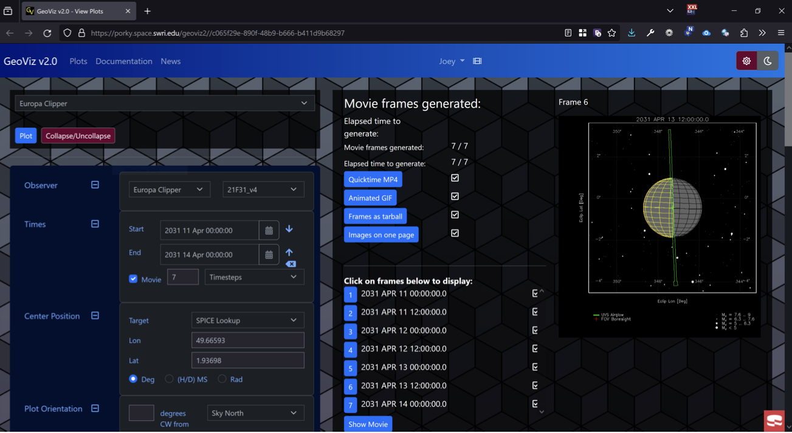
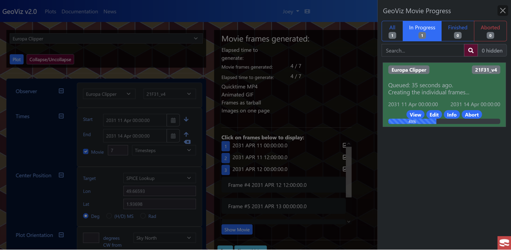

## Spacecraft Web Applications in a Hybrid Kubernetes Cluster

**Type**: Professional
**Role**: Team of 3 (Personally did software and cloud development research and implementation, includes web application UI/UX)

### Project Overview

In 2023, I had the opportunity to work on an innovative project focused on developing spacecraft web applications within a hybrid Kubernetes cluster. This initiative was part of a year-long grant awarded to the Southwest Research Institute, where I collaborated with a talented team of three. My primary responsibilities included software and cloud development research and implementation, along with the design of the web application UI/UX.

### The Challenge

As space science data continues to expand exponentially, traditional methods of data handling have become inadequate. Historically, the data received from space probes was smaller than the software required to process it. However, advancements in sensor technology have led to higher precision measurements and increased data throughput. Consequently, we needed a more efficient approach: instead of moving vast amounts of data to the software, we migrated the software to the data, leveraging cloud capabilities.

### Project Implementation

Our project involved the creation of a robust Kubernetes cluster that integrated on-premises servers, a high-performance computing cluster for resource-intensive tasks, and Amazon Web Services (AWS). This hybrid setup allowed us to effectively visualize science and engineering data, as well as facilitate spacecraft flyby planning.

The web applications we developed, collectively known as GeoViz, were designed for intuitive use, even when dealing with complex datasets like stellar catalogs. The user interface was crafted to enable scientists to queue thousands of flybys and monitor the status of their jobs seamlessly.

#### Key Features

- **Progressive Web App (PWA)**: GeoViz was developed as a PWA, allowing users to install the application on mobile devices. This feature enables scientists to access real-time updates on their plots and generated flight plans from anywhere.

- **User-Centric Design**: The UI was meticulously designed to ensure that even complex functionalities were understandable and accessible to users, enhancing the overall user experience.

### Presentations and Recognition

I had the privilege of presenting our work at two prominent conferences:

- **CakeFest 2023** in Los Angeles
- **DASH 2023** at Johns Hopkins Applied Physics Lab in Maryland

These presentations showcased our innovative approach and the impact of our work on the field of space science.

### Technical Details

- **Technologies Used**: The development utilized PHP (CakePHP), HTML, JavaScript, CSS, and Bootstrap.
- **Date Created**: 2023

### Additional Resources

For those interested in exploring our project further, here are some useful links:

- [Slides from CakeFest 2023](https://umer936.com/cakefest-2023/)
- [Presentation Video](https://www.youtube.com/live/4KB92R7UQc8?si=7rFNri7wxBw-BQmG)
- [Conference Recap Blog](https://www.cakedc.com/amanda/2023/10/12/cakefest-2023-recap)
- [Abstract/Presentation with DOI](https://zenodo.org/records/8412469)

### Conclusion

The development of the spacecraft web applications in a hybrid Kubernetes cluster not only addressed the challenges posed by the growing volume of space science data but also set a precedent for future projects in the field. By moving the software to the data, we have created a scalable and efficient solution that empowers scientists to visualize and analyze complex datasets effectively. This project exemplifies the potential of cloud technology in advancing space research and the importance of user-friendly design in scientific applications.
