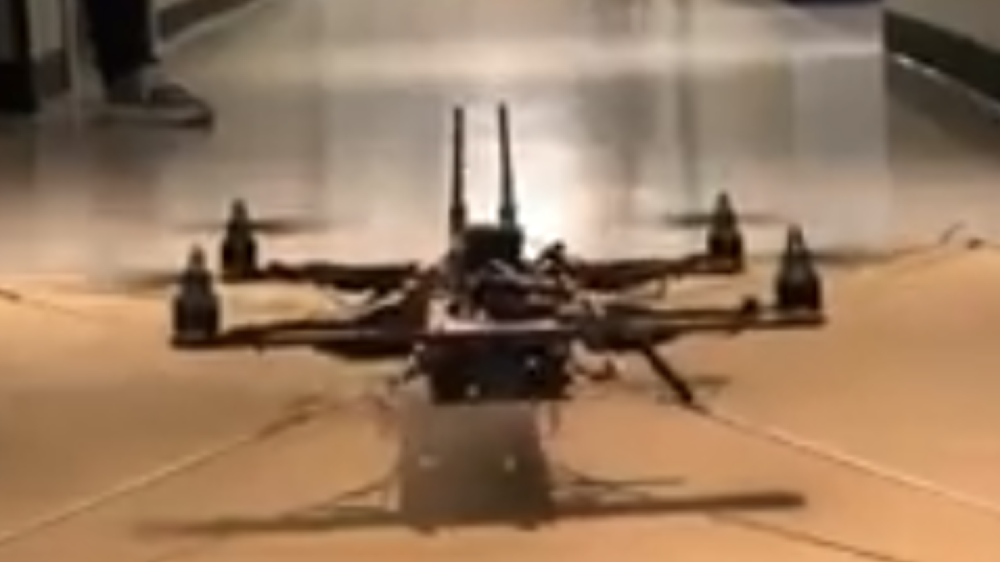

## Intelligent Quads: Empowering Drone Innovation

**Type**: Professional/Personal
**Role**: Co-founder/CTO, simulations, and software

### Project Overview

In December 2015, I co-founded Intelligent Quads (IQ) alongside two colleagues, spinning it off from our student organization, Texas Aerial Robotics (TAR). Our mission was to create a modular, customizable drone platform that would enable companies and researchers to develop their own innovative drone applications.

### The Challenge

While working in the aerospace labs, we observed that researchers lacked the necessary tools to fully realize their drone-related projects. Graduate students with cutting-edge computer vision (CV) algorithms often struggled to test and implement their ideas due to the challenges of building a stable drone platform. We recognized the need for an extensible base that could bridge this gap in the market.

### Project Implementation

To address this challenge, we developed a small drone called the 200 IQ, which featured a compact 12x12 inch form factor. The drone was equipped with two stereo cameras, one main camera, and a 300-gram payload capacity. It also included a Nvidia Jetson module for GPU acceleration, computer vision, and AI capabilities, as well as some GPS-denied functionality.

#### Key Features

- **Modular Design**: The 200 IQ was designed with modularity in mind, allowing researchers and companies to customize the drone to suit their specific needs.

- **Extensible Platform**: By providing an extensible base, we aimed to empower users to develop their own drone applications without the burden of building the entire platform from scratch.

- **Targeted Market**: While DJI focused on photography and hobbyist use cases, and military drone manufacturers catered to larger-scale projects, we identified a gap in the market for a solution tailored to researchers and companies developing innovative drone applications.

### Project Transformation

Due to various circumstances, we ultimately tabled the startup attempt and transformed the project into an educational platform on YouTube. Our channel, Intelligent Quads, has become a leading resource for showcasing how to create autonomous aerial vehicles in simulation and real life.

### Technical Details

- **Date Created**: December 2015
- **Mediums Used**: SolidWorks, Gazebo, ROS, Linux, C++
- **YouTube Channel**: https://www.youtube.com/@IntelligentQuads

### Conclusion

The Intelligent Quads project exemplifies our commitment to empowering innovation in the drone industry. By creating a modular, customizable drone platform, we aimed to provide researchers and companies with the tools they needed to push the boundaries of what's possible with aerial robotics. Although the startup attempt was tabled, the project lives on as an educational platform, sharing our knowledge and expertise with a wider audience.

## Intelligent Quads

### Project Overview

In December 2015, I co-founded Intelligent Quads (IQ) alongside two other partners, emerging from our student organization, Texas Aerial Robotics (TAR). Our mission was to create a modular and customizable drone platform that would empower companies and researchers to develop their own drone applications. 

### The Challenge

While working in aerospace labs, we identified a significant gap: researchers often lacked the necessary tools to effectively test and implement their computer vision (CV) algorithms. For instance, a graduate student might have a cutting-edge CV algorithm, but their drone would not perform optimally due to limitations in existing drone technology. The market was dominated by DJI, which focused primarily on photography and hobbyist applications, while military drones from companies like Lockheed Martin and Boeing did not cater to this niche.

### Project Implementation

To address this gap, we developed a small drone, the **200 IQ**, which featured:

- **12x12 inch form factor**
- **2 stereo cameras**
- **1 main camera**
- **300-gram payload capacity**
- **Nvidia Jetson for GPU/Computer Vision/AI capabilities**
- **Some GPS-denied capabilities**

This design allowed researchers to build and test their CV algorithms without the constraints of existing commercial drones. 

### Transition to Education

Due to timing constraints, we decided to table our startup attempt and instead transformed our efforts into an educational platform on YouTube. Our channel has since become a leading resource for showcasing how to create autonomous aerial vehicles, both in simulation and real life.

### Role

As the Co-founder and CTO, I focused on simulations and software development, ensuring that our drone platform met the needs of researchers and developers.

### Technical Details

- **Date Created**: December 2015
- **Mediums Used**: SolidWorks, Gazebo, ROS, Linux, C++, YouTube
- **Link to Startup Pitch**: [Google Docs](https://docs.google.com/presentation/d/1uBTDB0f6Ppi7vs0JmQiL5e7HYlslRMv5_JfU1vtYBeM/edit#slide=id.g4a83cbe869_0_238)
- **YouTube Channel**: [Intelligent Quads](https://www.youtube.com/@IntelligentQuads)

### Conclusion

The Intelligent Quads project exemplified the intersection of innovation and education in the field of drone technology. By addressing the specific needs of researchers and providing a platform for experimentation, we have contributed to the advancement of autonomous aerial vehicles and fostered a community of learners and creators.
