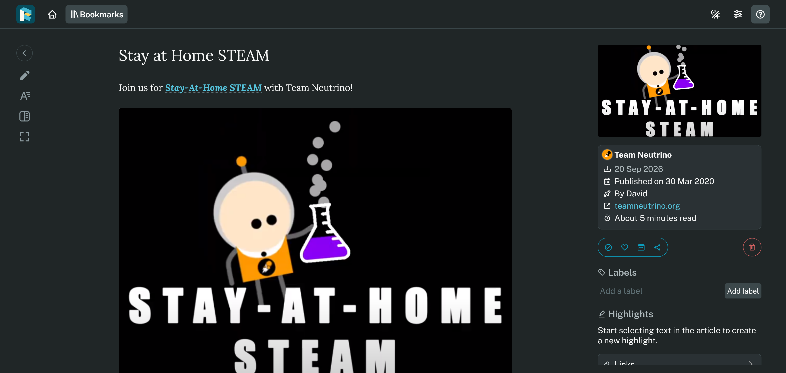
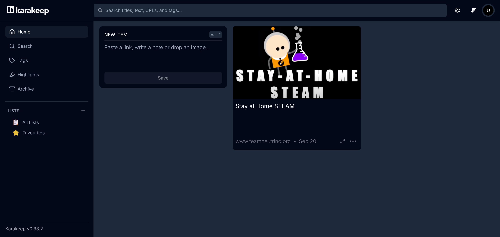
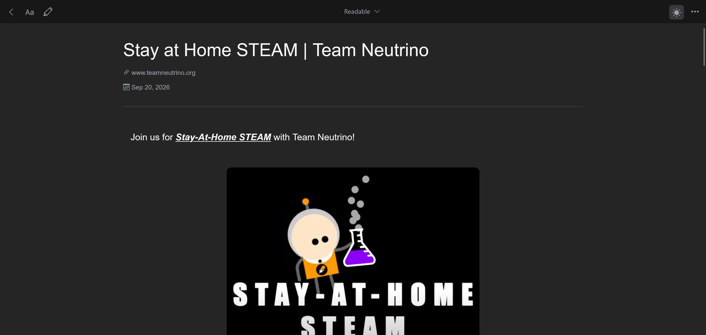
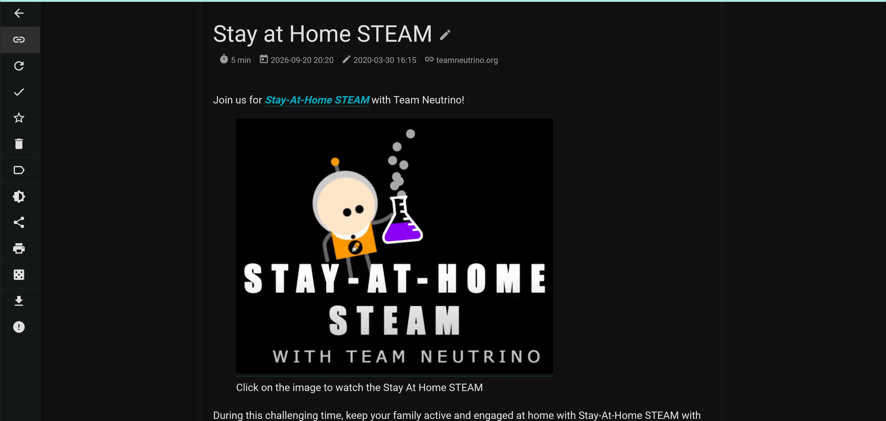
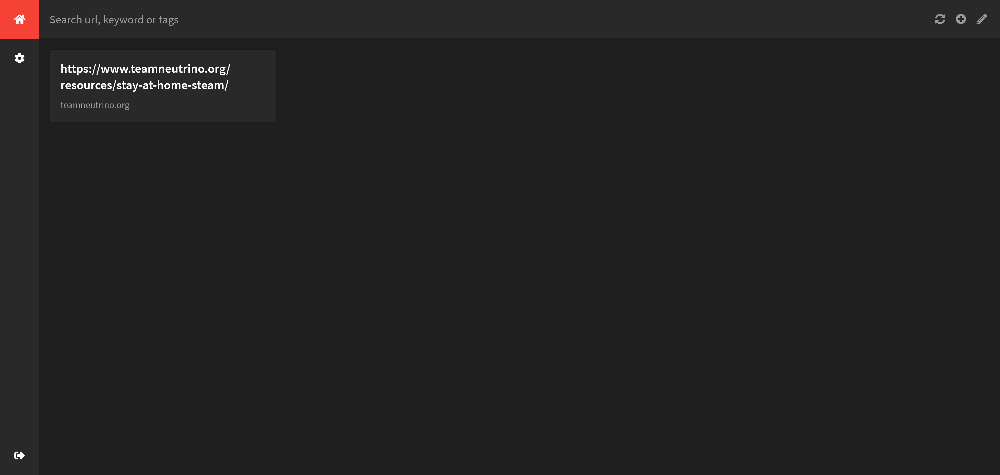

I wanted a Pocket replacement.

Pocket is dead now. MyMind was probably my favorite since it does the whole AI bookmarks / notes / highlights thing really well, but I like self-hosting and I wasn't using it enough.

1) [ReadDeck](https://readeck.org/en/)
   
   Seems ok, but it doesn't really cover the features I want.

2) [Karakeep](https://karakeep.app/)
   
   Better, but I think I'd rather just pay for MyMind than use this.

3) [Linkwarden](https://linkwarden.app/)
   
   Yep, this works. It has the webpage view so I can hop to the main page.
   Oh nice, it has an archive.org integration so I can save a copy of the page.

4) [Wallabag](https://wallabag.org/)
   
   Yep, this one works too. Not sure which I like more between this and Linkwarden.
   I like the theme better, especially the different colored links that stand out, but overall I think I still like Linkwarden better.

5) [Shiori](https://github.com/go-shiori/shiori)
   
   Nope, way too simple.
